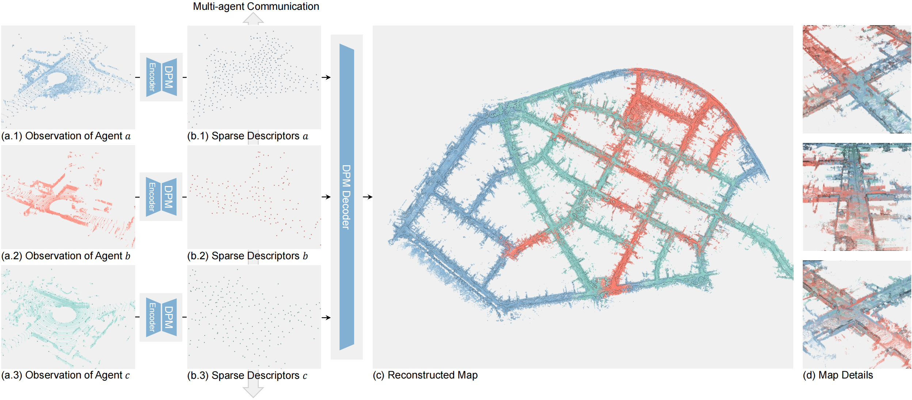
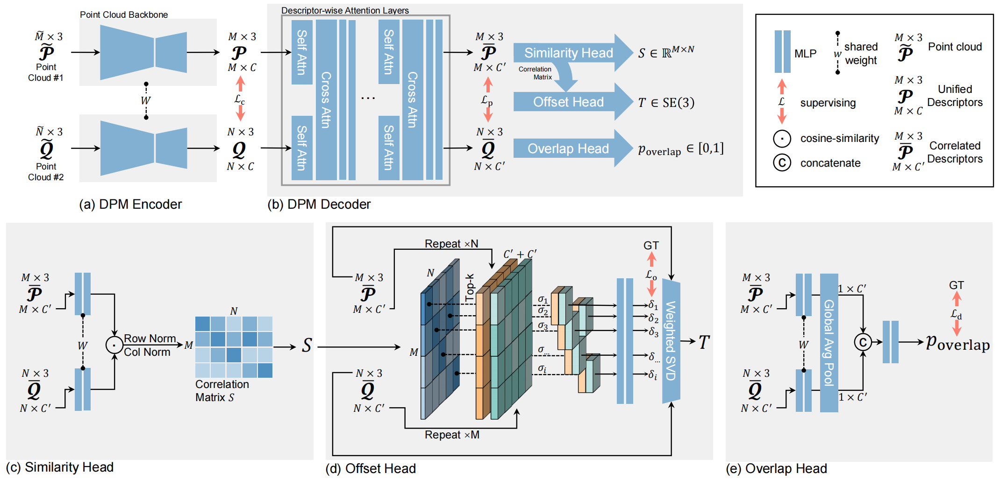

# DeepPointMap: Advancing LiDAR SLAM with Unified Neural Descriptors

[DeepPointMap](https://arxiv.org/abs/2312.02684) is a 3D LiDAR SLAM framework based on neural network implemented on python and pytorch. 

This is the official repository.

## Introduction





## Preparation

The DeepPointMap is tested on `Ubuntu 20.04`.


### PyTorch

Install PyTorch following this [link](https://pytorch.org/get-started/locally/), for example,

```bash
conda install pytorch==2.0.1 torchvision==0.15.2 torchaudio==2.0.2 pytorch-cuda=11.7 -c pytorch -c nvidia
```

PyTorch version we tested with: `2.0.1`


### pytorch3d

Pytorch3d can significantly accurate the inference speed of our backbone. Although DeepPointMap can partially run without pytorch3d, the inference speed and experiment result is not granted.

Install pytorch3d following this [link](https://github.com/facebookresearch/pytorch3d/blob/main/INSTALL.md#installation):
```bash
# Linux Only
conda install pytorch3d -c pytorch3d
```

For Windows OS, we recommend you install pytorch3d via '[Building / installing from source](https://github.com/facebookresearch/pytorch3d/blob/main/INSTALL.md#building--installing-from-source)':

```bash
pip install "git+https://github.com/facebookresearch/pytorch3d.git@stable"
```

pytorch3d version we tested with: `0.7.4`


### Open3D

We use Open3D to preprocess the point cloud data. Follow its [official instruction](http://www.open3d.org/) to install Open3D:

```bash
pip install open3d
```

**NOTE**: Open3D seems not compatible with `Ubuntu < 18.04`.

Open3D version we tested with: `0.16.0`


### evo (optional)

[evo](https://github.com/MichaelGrupp/evo) provides executables and a small library for handling, evaluating and comparing the trajectory output of odometry and SLAM algorithms. We recommend you use this package to evaluate the output result.

```bash
pip install evo --upgrade --no-binary evo
```

However, you can always use your own evaluation toolkit instead.

### Other Packages

```bash
pip install -r requirements.txt
```


## Inference

### Data and Model

DeepPointMap takes the standard KITTI `.bin` file sequence as inference input. Specifically,

- Each sequence are placed in different directory. A short example sequence can be found in `./data/sample`.
- Each directory contains some `<frame_id>.bin` files in sequence. The `<frame_id>` is a int and indicates frame order.
- `.bin` file only stores the point cloud data, with the shape of `(N, 4)`, dtype `float32` in binary, see `./dataloader/heads/bin.py` for more details.

KITTI dataset (as well as KITTI-360) can be directly feed into DeepPointMap. However, if you are using other dataset, make sure to convert them into right format. (For development, you can also implement a new dataloader head in `./dataloader/heads`)

Pretrained model weight can be found in `./weights`.

### Commands
Use the following command for testing. 

```bash
python pipeline/infer.py --yaml_file <config.yaml> --weight <model.pth>
```

The `<config.yaml>` and `<model.pth>` are the configuration and pretrained model file path. For example,

```bash
python pipeline/infer.py --yaml_file ./configs/infer/DeepPointMap_B_Main_SemanticKITTI.yaml --weight ./DeepPointMapAAAI.pth
python pipeline/infer.py --yaml_file ./configs/infer/DeepPointMap_B_Main_KITTI360.yaml --weight ./DeepPointMapAAAI.pth
python pipeline/infer.py --yaml_file ./configs/infer/DeepPointMap_B_Main_MulRan.yaml --weight ./DeepPointMapAAAI.pth
```

Remember to replace the `infer_src` in `.yaml` config file to your dataset path.

If `torch.cuda.is_available() == True` in your environment, `cuda:0` is selected by default and you can use `--gpu_index <gpu_id>` to specify one. Otherwise CPU is used.

More argument details can be found in `./pipeline/parameters.py`.

**WARNING**: If a argument is specified in configuration file (`<xx.yaml>`) and console at the same time, the final value will be set to those in configuration file (i.e., priority: yaml > console).

**NOTE**: By default, DeepPointMap will visualize the reconstructed point cloud map and save it as `.png` file at the end of inference procedure for each sequence. This action is extremely slow so you may wait up to 5 minutes for each sequence. To disable this, comment out all the code like `.draw_trajectory(...)`.

### Results

For each sequence, the result will be saved to `<infer_tgt>/Seq<seq_index>`. `<infer_tgt>` is a argument provided in configuration file or console, default to 'log_infer'. Each result dir contains these files:

- `settings.yaml`: The parameters used in this inference.
- `trajectory.allframes.txt`: The estimated trajectory of LiDAR sensor, one line per frame, in KITTI ground-truth format.
- `trajectory.allsteps.txt`: The frame index of each pose estimated in `trajectory.allframes.txt`. In some rare scenarios, DeepPointMap may discard some frame with bad estimation quality i.e., not all frame from dataset will be used. This file can help you to find out which frames are missing. If you strictly need the pose for each frame, estimate it using interpolation etc.
- `trajectory.keyframes.txt` and `trajectory.keysteps.txt`: same above, but only record keyframes' information selected by DeepPointMap.
- `trajectory.map.jpg`: Visualized trajectory and point cloud map.
- Others.

### Evaluation

You can use [evo](https://github.com/MichaelGrupp/evo) or your own evaluation toolkit to evaluate the results.


There are some facts:

- The pose estimated is **ALWAYS** in LiDAR coordinate system.
- The pose of the first frame is always `r = eye(3), t = (0, 0, 0)`
- In some rare cases, DeepPointMap may discard some frame with bad estimation quality, thus the `trajectory.allframes.txt` may have different line number with `<gt_traj>.txt`. When using your own evaluation toolkit, you should either (a) discard the corresponding frames from ground truth file, or (b) use interpolation (or something else) to fulfill the `trajectory.allframes.txt`.


## Update and TODOs

- 202403: Paper accepted by [AAAI2024](https://ojs.aaai.org/index.php/AAAI/article/view/28909).
- 231205: Paper is available at [arXiv](https://arxiv.org/abs/2312.02684).
- 231213: Inference code and pretrained model released.
- TODO: Release Training Code
- TODO: Release Inference Code for ROS2


## How to cite
If you use our work in your research project, please consider citing our original [paper](https://ojs.aaai.org/index.php/AAAI/article/view/28909)

```bibtex
@inproceedings{zhang2024deeppointmap,
  title={DeepPointMap: Advancing LiDAR SLAM with Unified Neural Descriptors},
  author={Zhang, Xiaze and Ding, Ziheng and Jing, Qi and Zhang, Yuejie and Ding, Wenchao and Feng, Rui},
  booktitle={Proceedings of the AAAI Conference on Artificial Intelligence},
  volume={38},
  number={9},
  pages={10413--10421},
  year={2024}
}
```